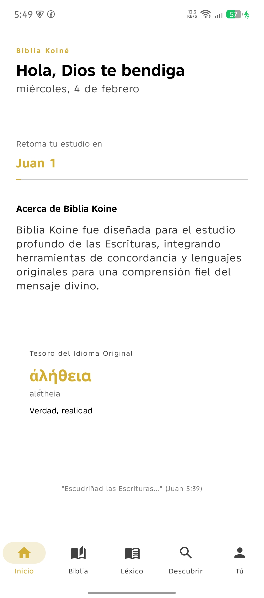
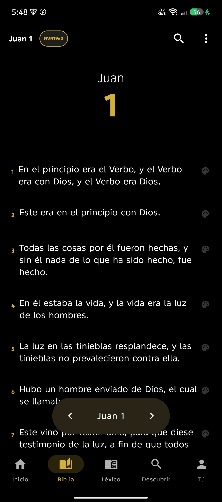
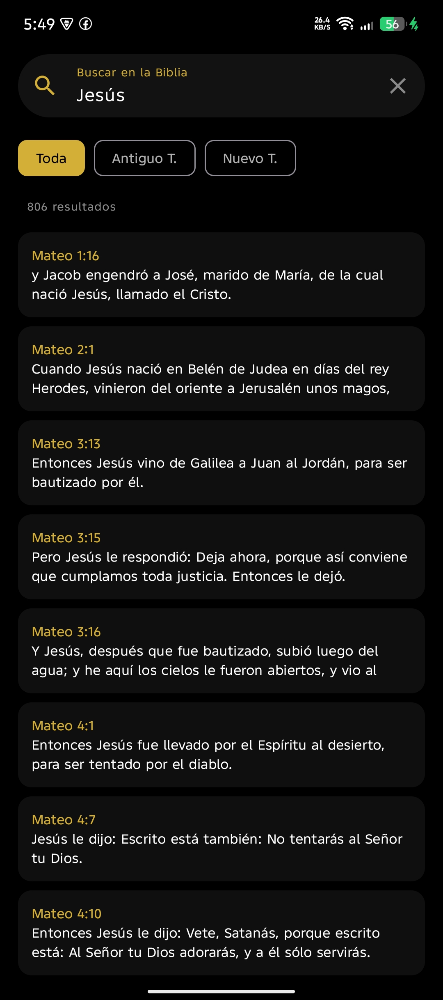
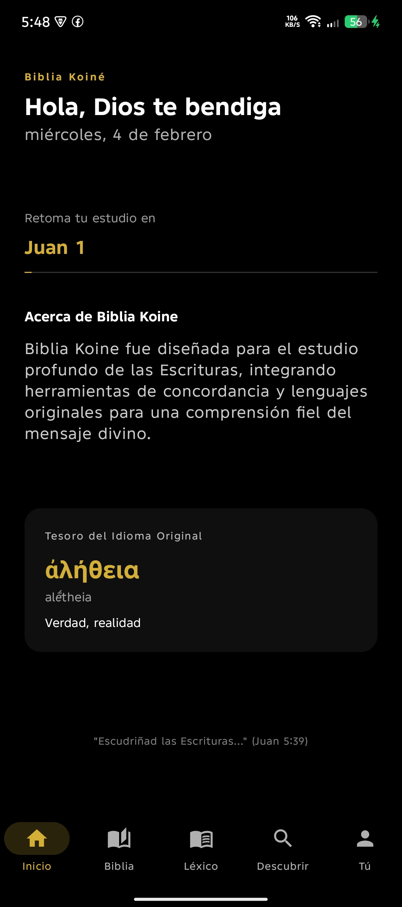
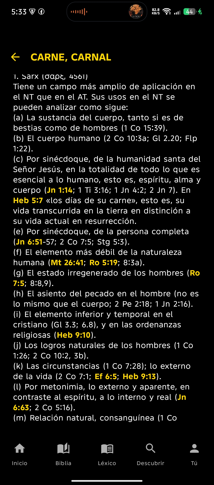

# 📖 BibliaKoine: Una Inmersión Profunda en el Texto Sagrado

[](https://www.android.com)
[](https://kotlinlang.org)
[](LICENSE)
[](https://github.com/KuroMusic/BibliaKoine/releases)

**BibliaKoine** no es simplemente otra aplicación de lectura bíblica. Es un ecosistema digital diseñado para el estudio serio, la reflexión profunda y la accesibilidad moderna. Nacida de la necesidad de unir la riqueza de los idiomas originales con una interfaz de usuario fluida y estética, BibliaKoine representa el pináculo de las herramientas de estudio en español.

---

## 📸 Galería del Proyecto

<div align="center">
  <table style="border: none;">
    <tr>
      <td align="center"><b>Dashboard Moderno</b><br/></td>
      <td align="center"><b>Estudio Profundo</b><br/></td>
      <td align="center"><b>Buscador FTS5</b><br/></td>
    </tr>
    <tr>
      <td align="center"><b>Modo Oscuro</b><br/></td>
      <td align="center" colspan="2"><b>Strong Interactivo</b><br/></td>
    </tr>
  </table>
</div>

---

## ✨ La Historia de BibliaKoine: Un Legado Moderno

La visión de **BibliaKoine** surgió del deseo de democratizar el acceso a herramientas de exégesis que antes estaban reservadas para software de escritorio complejo. Queríamos una aplicación que fuera **"brutalmente simple"** pero **"técnicamente potente"**.

Desde la integración del **Diccionario Vine** hasta la sincronización en tiempo real de la **Concordancia Strong**, cada línea de código ha sido escrita pensando en la experiencia del usuario. No se trata solo de leer, se trata de descubrir los matices del griego y hebreo sin perder la fluidez de una aplicación móvil de alta gama.

> [!NOTE]
> BibliaKoine es un proyecto **100% Open Source**, creado sin fines de lucro, con el único propósito de proveer la herramienta más actualizada y profesional para el mundo hispanohablante.

---

## 🚀 Características Principales

### 🔍 Buscador de Alta Precisión (FTS5)

Implementamos tecnología de búsqueda a texto completo de última generación. Encuentra instantáneamente cualquier versículo en la versión que prefieras con filtros por testamento.

### 📚 Lexicografía Integrada

- **Diccionario Vine**: Acceso inmediato a significados profundos.
- **Números Strong**: Códigos integrativos que conectan cada palabra con su raíz original (Necesito modificacion ya que esta desactivado).
- **Citas Interactivas**: Las referencias dentro del diccionario son clicables, abriendo previsualizaciones instantáneas. (en proceso de mejora)

### 🎨 Experiencia de Lectura Premium (Material 3)

- **Selector de Libros Inteligente**: Un sistema de acordeón que predice tus necesidades según lo que estés leyendo.
- **Modo Oscuro Dinámico**: Adaptación total a tu entorno para una lectura cómoda.
- **Notas y Marcadores**: Guarda tus reflexiones con una interfaz minimalista y elegante. (falta mejorar)

---

## 🛠️ Arquitectura Técnica

BibliaKoine utiliza los estándares más altos de la industria Android actual:

- **Lenguaje**: `Kotlin` (100%)
- **UI**: `Jetpack Compose` para una interfaz declarativa y reactiva.
- **Arquitectura**: `MVVM` (Model-View-ViewModel) + Clean Architecture.
- **Base de Datos**: `Room` con búsqueda FTS5 avanzada.
- **Gestión de Estado**: `StateFlow` y `SharedFlow` para reactividad pura.

---

## 📥 Cómo Empezar

Si eres desarrollador y quieres colaborar o estudiar este proyecto modernísimo, sigue estos pasos:

### 1. Clonar el repositorio

```bash
git clone https://github.com/KuroMusic/BibliaKoine.git
```

### 2. Abrir en Android Studio

Asegúrate de tener la última versión estable de **Android Studio (Ladybug o superior)**.

### 3. Sincronizar Gradle

Haz click en "Sync Project with Gradle Files" y deja que la magia ocurra.

---

## 🤝 Colaboración y Comunidad

Este proyecto es de la comunidad para la comunidad. Si tienes ideas, correcciones o nuevas funcionalidades:

1. Haz un **Fork** del proyecto.
2. Crea una rama para tu característica (`git checkout -b feature/AmazingFeature`).
3. Envía un **Pull Request**.

---

## ⚖️ Licencia y Copyright

Este código es totalmente **Open Source** bajo la licencia MIT. Es un regalo para la comunidad de estudiantes y desarrolladores. Queda prohibido el uso de este material para fines lucrativos sin el consentimiento expreso de la comunidad BibliaKoine.

**"Porque la Palabra es viva y eficaz..."**

---

<div align="center">
  <p>Desarrollado con ❤️ para el estudio de la Verdad.</p>
</div>
